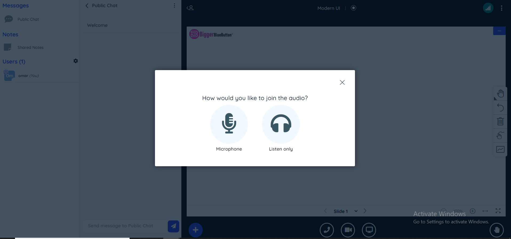
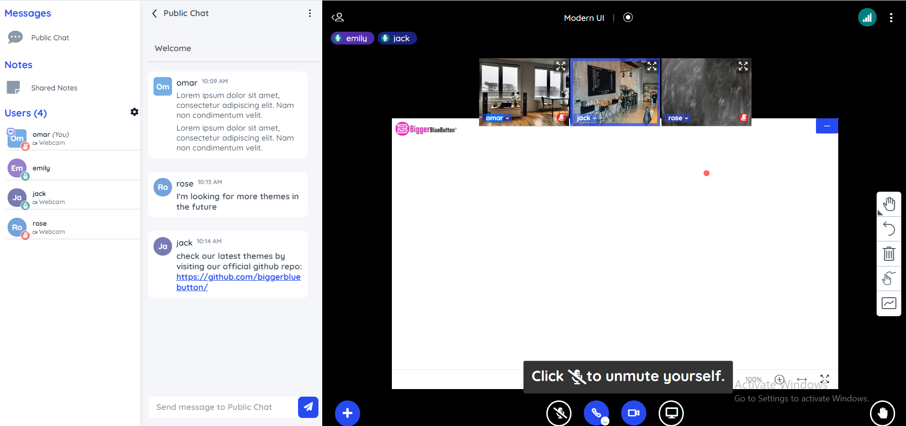

BigBlueButton Modern UI Theme
====
### BigBlueButton them by BiggerBlueButton
css theme file that gives bigbluebutton modern appearance 

this is the default theme of biggerbluebutton meeting and you can see a live demo on our website 

## demo 
Check the live demo by creating new meeting on [biggerbluebutton](https://biggerbluebutton.com)

### main changes

- background color to black
- replaced main icons with font-awesome icons 
- modern design experience using box shadow and nice borders for users list and chat list

### screenshots

### usage

apply this theme by adding this field to API join method 

userdata-bbb_custom_style_url=https://biggerbluebutton.com/themes/modern.css

you can also upload modern.css file directly to the public directory on your server and replace the URL with yours

#MIT License
Permission is hereby granted, free of charge, to any person obtaining a copy of this software and associated documentation files (the “Software”), to deal in the Software without restriction, including without limitation the rights to use, copy, modify, merge, publish, distribute, sublicense, and/or sell copies of the Software, and to permit persons to whom the Software is furnished to do so, subject to the following conditions:

The above copyright notice and this permission notice shall be included in all copies or substantial portions of the Software.